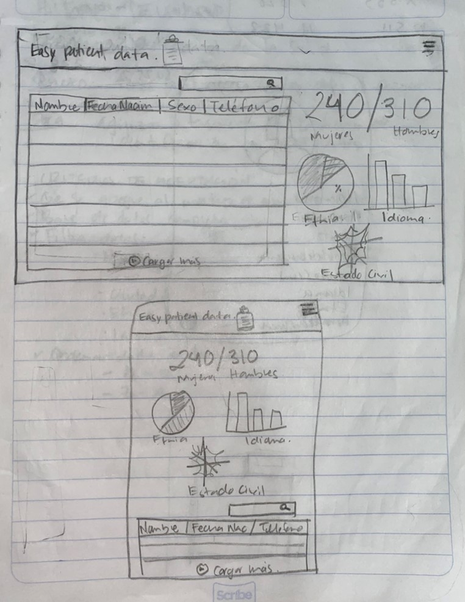

# :syringe: EASY PATIENT DATA

### :bulb: PROCESO CREATIVO 

El primero paso fue escoger un tema, se nos dio acceso a varias API relacionadas con temas diversos, se decidió por "pacientes en Estados Unidos", se consideró que el podríamos obtener un resultado útil en el área de la salud.

[EEUU patiens](src/data/patient/patient.json).

Este listado muestra a un grupo de pacientes de Estados Unidos, puedes revisar la documentación de esta API en este link [link](https://r2.smarthealthit.orlag/Patient).
 
La idea fue realizar una base de datos de fácil acceso y consultas sobre pacientes podría ser útil para cualquier área de la salud (medicina, enfermería, estomatología, optometría, psicología, productos farmacéuticos, nutrición, etc.) independientemente de si los profesionales de las áreas relevantes participan en actividades públicas o privadas. 
 

### :question:Estudio de los usuarios

El segundo paso fue consultar con varios profesionales de la salud para identificar qué datos de pacientes eran más importantes o útiles para organizar una base de datos médica. Realizamos la encuesta para acercarnos a los usuarios, conocer sus necesidades y perspectivas al utilizar una base de datos digital como herramienta de trabajo. 

Aquí las preguntas :

 
 
 
 
 
 
 

### :pencil:Resultados

Entre los profesionales que respondieron el cuestionario se encuentran: dentistas generales, dentistas pediátricos, endodoncistas, neurólogos, enfermeras, psicólogos, médicos y optometristas.
 

Los datos que se le pide a un paciente que complete un formulario de identificación son: nombre, edad, dirección, sexo, fecha de nacimiento, estado civil.
 

En un 61.7%, el personal del área de salud expresó que ordenan los archivos por el apellido del paciente.
 

El 87.2% dijo que usa un registro clínico en papel y solo el 12.8% usa registros clínicos digitales.

El estado civil, el sexo, la fecha de la última consulta y el lugar de origen son los datos que podrían observarse estadísticamente en las bases de datos médicas.

Los colores más relacionados con la historia clínica digital fueron: azul, verde y blanco. Los cuales fueron tomadas a la hora de diseñar la interfaz de usuario.
 

La última pregunta se realizó para poder implementarla en una base de datos futura, de acuerdo con las necesidades específicas de cada profesional.
 

### :rotating_light: Problemática

El personal del área de la salud enfrenta diariamente el procesamiento de consultas y los datos en grandes cantidades, ya sea por el número de pacientes que maneja o los datos recopilados de cada paciente; lo que puede convertirse en una organización difícil, molesta y descuidada en la base de datos médica. Además, debido a los resultados de la encuesta que realiza el personal médico, no se acerca mucho a las tecnologías digitales o nuevas cuando se trata de administración.

### :computer: Propuesta

Una base de datos médica digital para facilitar el manejo y la consulta del paciente en una pequeña oficina, clínica e incluso un hospital.

### :bust_in_silhouette: Historias de Usuario

:uno: 

Como : Profesional de la salud.

Quiero: Fácil acceso a un listado de pacientes.

Para: Agilizar el proceso de búsqueda de los datos de un paciente.

:dos:

Como: Como usuario de Easy Patients Data.

Quiero: Poder visualizar el sitio en cualquier dispositivo.

Para: Tener acceso fácil y rápido a los datos de cada paciente.

### :vhs:Prototipo de baja fidelidad 

Durante esta etapa, diseñamos nuestra interfaz de usuario con lápiz, ordenamos los datos en función de los resultados del cuestionario, pensamos en el nombre de nuestra aplicación web, la distribución de los elementos a consultar y cómo se vería en una pantalla de escritorio y en la pantalla de un teléfono celular.

 

 

Solicitamos feedback en tres ocasiones de nuestros coaches y también de nuestras compañeras del bootcamp.

### :iphone: Prototipo de alta fidelidad

Para desarrollar esta parte, tomamos en cuenta los comentarios por parte de nuestros coach y nuestras compañeras, así como los de los encuestados. El prototipo fue desarrollado en Figma.

Prototipo para vista móvil

Prototipa para vista de escritorio

### :pushpin:LEARNING OBJECTIVES

 **UX**
- [x] Design the application thinking and understanding the user.
- [x] Prototyping to get _ feedback _ and iterate.
- [x] Apply the principles of visual design (contrast, alignment, hierarchy).
- [x] Plan and run usability tests.

**HTML y CSS**
- [x] Understand and recognize why semantic HTML is important.
- [x] Identify and understand CSS selector types.
- [x] Understand how `flexbox` works in CSS.
- [x] Build your application respecting the planned design (layout).

**DOM**
- [X] Understand and recognize DOM selectors (querySelector | querySelectorAll).
- [X] Handle DOM events.(addEventListener)
- [X] Dynamically manipulate the DOM. (createElement, appendchild, innerHTML, value)

**Javascript**
- [X] Manipulate arrays (`filter` | `map` | `sort` | `reduce`).
- [X] Manipulate objects (key | value).
- [x] Understand the use of conditionals (`if-else` | `switch`).
- [X] Understand the use of loops (`for` | `forEach`).
- [ ] Understand the difference between expression and statements.
- [x] Use functions (parameters | arguments | return value).
- [ ] Understand the difference between atomic and structured data types.
- [X] ES Modules (`import` | `export`).

**Unit tests (_testing_)**
- [ ] Test functions (pure functions).

 **Git y GitHub**
- [x] Run git commands (`add` | `commit` | `pull` | `status` | `push`).
- [x] Use the GitHub repositories (`clone` | `fork` | gh-pages).
- [x] Collaborate on Github (pull requests).

**Good development practices**
- [x] Organize and divide the code into modules (Modularization).
- [x] Use descriptive identifiers (Nomenclature | Semantics).
- [ ] Use linter to follow good practices (ESLINT).

